# CMS-SQL-Employee_Tracker_1.0
[](https://opensource.org/licenses/MIT)
<br>
Video Deonstration:<br>
https://drive.google.com/file/d/1b2uBC9F_ksMX788BVMRChcG56Alg7Oiw/view?usp=sharing
<br>


## Project Description
As a business owner, I want to be able to view and manage the departments, roles, and employees in my company so that I can organize and plan my business

## Table of Contents
- [Installation](#installation)
- [Usage](#usage)
- [License](#license)
- [Contributing](#contributing)
- [Questions](#questions)
  
## Installation
To install necessary dependencies, run the following command:
```
npm i
```

  
## Usage
This application is very simple to use and therefore very simple to keep track of your company's employees. When we start the application on the command line, you are presented with the following menu that's operated by using the arrows on the keyboard:
<br>
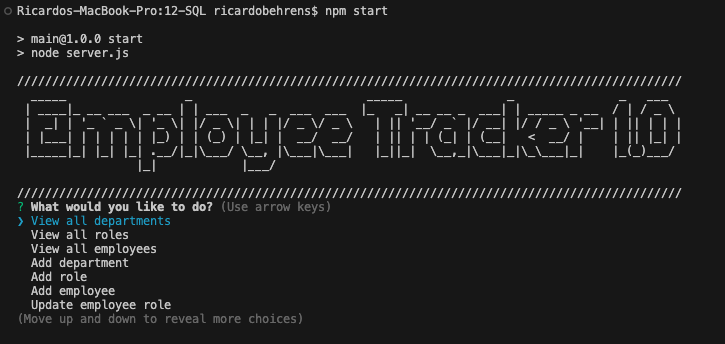
<br>

- When the user chooses "View all departments", the department table is consoled in the terminal with the department id and name. After selecting the action, the initial menu shows up in the terminal again for the next action.
<br>
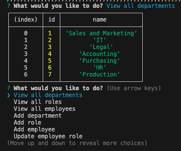
<br>

- When the user chooses "View all roles", the role table is consoled in the terminal with the job title, role id, the department that role belongs to, and the salary for that role. After selecting the action, the initial menu shows up in the terminal again for the next action.
<br>
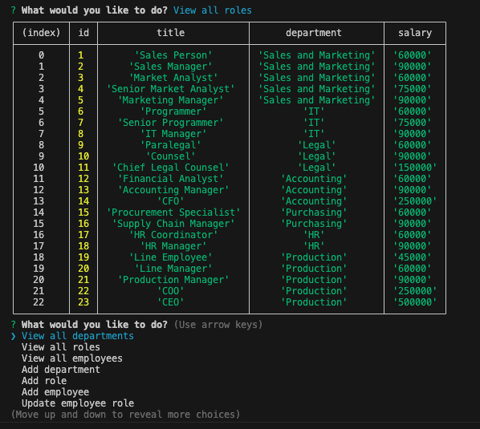
<br>

- When the user selects "View all employees", the employee table is consoled in the terminal with the employee ids, first names, last names, job titles, departments, salaries, and managers that the employees report to. After selecting the action, the initial menu shows up in the terminal again for the next action.
<br>
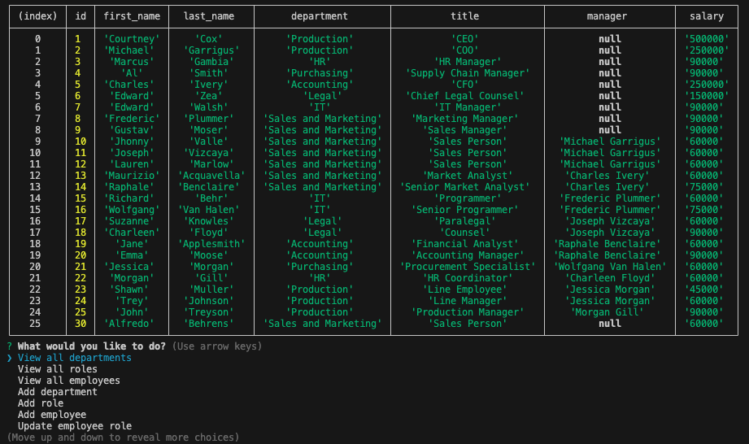
<br>

- When the user selects "Add a department", then it is prompted to enter the name of the department and that department is added to the database. After selecting the action, the initial menu shows up in the terminal again for the next action.
<br>

<br>

- When the user selects "Add a role", then it is prompted to enter the name, salary, and department for the role and that role is added to the database. After selecting the action, the initial menu shows up in the terminal again for the next action.
<br>
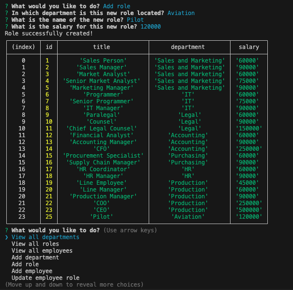
<br>

- When the user selects "Add an employee", then it is prompted to enter the employee’s first name, last name, role, and manager, and that employee is added to the database. After selecting the action, the initial menu shows up in the terminal again for the next action.
<br>
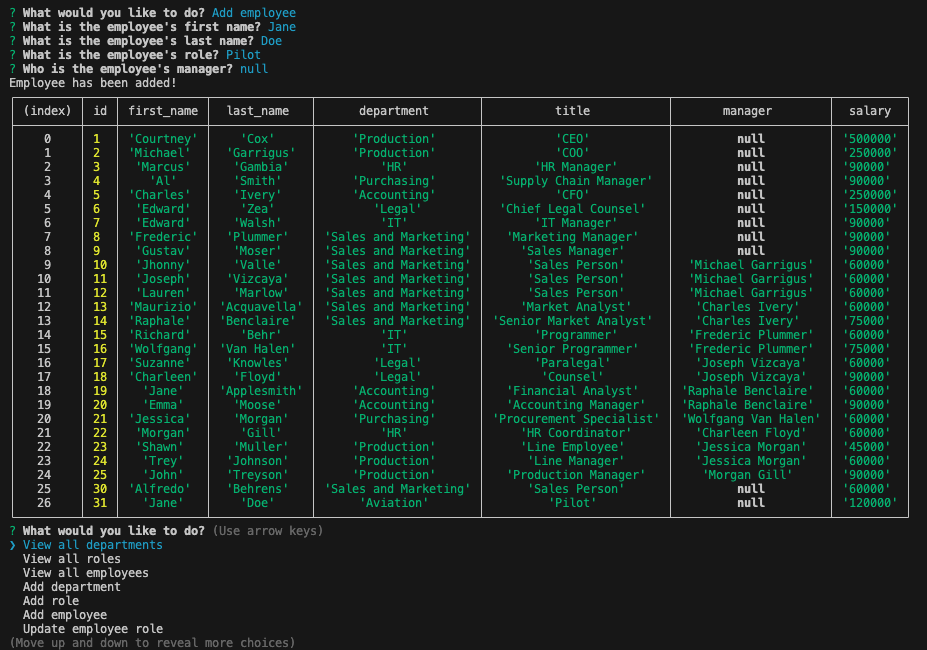
<br>

- When the user selects "Update an employee role", then it is prompted to select an employee to update and their new role and this information is updated in the database. After selecting the action, the initial menu shows up in the terminal again for the next action.
<br>
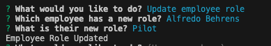
<br>

- When the user selects "Remove department", the user is prompted to see which department will the user like to remove from the database. After selecting the action, the initial menu shows up in the terminal again for the next action.
<br>
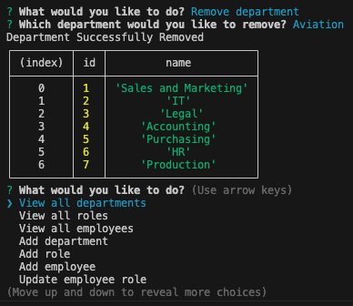
<br>

- When the user selects "Remove role", it is prompted to select which role would the user like to remove from the database. After selecting the action, the initial menu shows up in the terminal again for the next action.
<br>
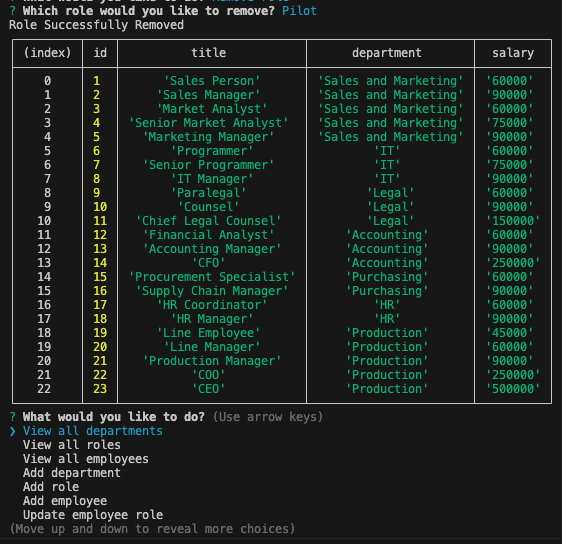
<br>

- When the user chooses to "Remove employee", it is prompted to select which employee the user would like to remove from the database. After selecting the user, the initial menu shows up in the terminal again for the next action.
<br>
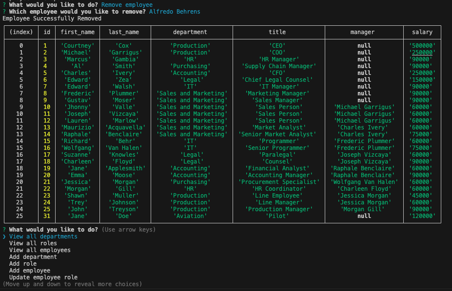
<br>

- Finally, if the user has decided it doesn't want to continue with the application, the user can choose "Quit" to exit and terminate the application.
<br>
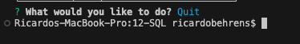
<br>

  
## License
This project is licensed under the MIT license.


Copyright 2023 Ricardo Behrens. All rights reserved.

Permission is hereby granted, free of charge, to any person obtaining a copy of this software and associated documentation files (the "Software"), to deal in the Software without restriction, including without limitation the rights to use, copy, modify, merge, publish, distribute, sublicense, and/or sell copies of the Software, and to permit persons to whom the Software is furnished to do so, subject to the following conditions:

The above copyright notice and this permission notice shall be included in all copies or substantial portions of the Software.

THE SOFTWARE IS PROVIDED "AS IS", WITHOUT WARRANTY OF ANY KIND, EXPRESS OR IMPLIED, INCLUDING BUT NOT LIMITED TO THE WARRANTIES OF MERCHANTABILITY, FITNESS FOR A PARTICULAR PURPOSE AND NONINFRINGEMENT. IN NO EVENT SHALL THE AUTHORS OR COPYRIGHT HOLDERS BE LIABLE FOR ANY CLAIM, DAMAGES OR OTHER LIABILITY, WHETHER IN AN ACTION OF CONTRACT, TORT OR OTHERWISE, ARISING FROM, OUT OF OR IN CONNECTION WITH THE SOFTWARE OR THE USE OR OTHER DEALINGS IN THE SOFTWARE.
  
    
## Contributing
If the user has any questions, he/she should refer to the "Questions" section in the generated README.

  
## Questions
If you have any questions about the repo, open an issue or contact me directly at [behrensricardo@gmail.com](mailto:behrensricardo@gmail.com). You can find more of my work at [rickybehrens](https://github.com/rickybehrens).

